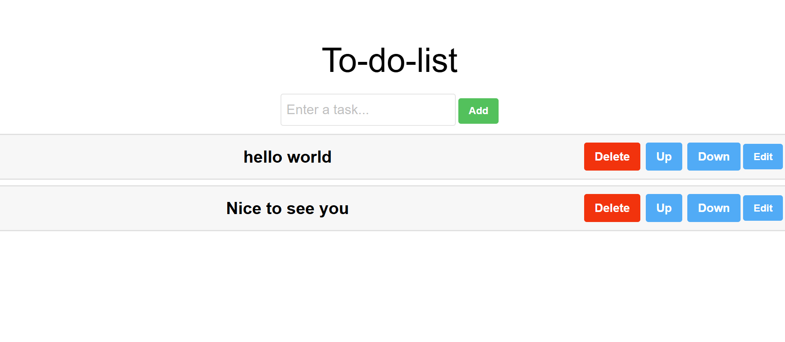

# 📌 **To-Do List App**
## *This is the Simple TodoList App*
## 📸 Screenshot


## 🚀 **Features**
- Add, update, delete, moveup and movedown tasks.
- Data persists using `localStorage`.

## 🛠 **Technologies Used**
- React
- JavaScript
- LocalStorage
- CSS
  
## 📦 Installation
```bash
git clone https://github.com/your-username/todo-app.git
cd todo-app
npm install
npm start
